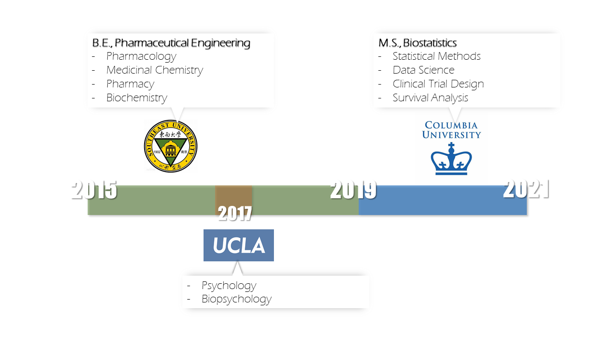

# {.tabset .tabset-fade}


## Work 

```{r, echo=FALSE, warning=FALSE}
library(timevis)

jnj <- sprintf(
   '<table><tbody>
      <tr>
        <td></td>
      </tr>
      <tr>
        <td><p>Statistical Programmer -> Experienced Statistical Programmer I</p></td>
      </tr>
      <tr>
        <td><li>COVID-19/RSV/EBOLA Vaccine</li></td>
      </tr>
      <tr>
        <td><li>Simponi®</li></td>
      </tr>
      <tr>
        <td><li>Icotrokinra®</li></td>
      </tr>
    </tbody></table>')

pfizer2 <- sprintf(
   '<table><tbody>
      <tr>
        <td></td>
      </tr>
        <td><p>Statistical Programmer Intern</p></td>
    </tbody></table>')

axa <- sprintf(
   '<table><tbody>
      <tr>
        <td></td>
      </tr>
        <td><p>Data Science Intern</p></td>
    </tbody></table>')

pfizer1 <- sprintf(
   '<table><tbody>
      <tr>
        <td></td>
      </tr>
        <td><p>Medical Affairs Intern</p></td>
    </tbody></table>')


data <- data.frame(
  id      = 1:4,
  content = c(jnj, 
              pfizer2,
              axa, 
              pfizer1),
  start   = c("2021-07-01", 
              "2020-09-01",
              "2020-05-01", 
              "2018-08-01"),
  end     = c(Sys.Date(), 
              NA, 
              NA, 
              NA),
  style   = c("border-color: lightgray; background-color: #EDE3E7",
              rep("border-color: lightgray; background-color: whitesmoke",3))
)

timevis(data, width=900, height=400)


```


## Education 




